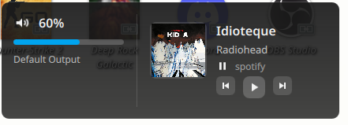

# Win10 Audio OSD (KDE Plasma 6.5)

Русская версия: `README.ru.md`

Example (how it looks):



Custom Windows 10–style audio OSD overlay for KDE Plasma. Shows volume and current media info (MPRIS).

## Notes

- Run the daemon as your user (not `sudo`). It needs your user DBus/Wayland session.
- The overlay listens to `pactl subscribe`, so it appears on any volume change.
- Media info works for any player that exposes **MPRIS**. We use `playerctl` first for better compatibility.

## Install

```
./scripts/install.sh
```

If you want to skip dependency installation:

```
./scripts/install.sh --no-deps
```

The installer supports `pacman`, `apt-get`, and `dnf`. If your distro differs, install manually:

- Python 3
- PySide6
- Qt6 Declarative (QML)
- `pactl` (pipewire-pulse or pulseaudio-utils)
- `playerctl`
- Optional: `qdbus6` (qt6-tools). Otherwise it falls back to `busctl`.
- Optional (web players): `plasma-browser-integration` and the browser extension.

## Web Players (YouTube, Spotify Web, SoundCloud, Yandex Music Web)

Install:
- `plasma-browser-integration`
- KDE browser extension for your browser

Then check MPRIS:

```
qdbus6 | rg mpris
```

If you see entries like `org.mpris.MediaPlayer2.chromium` or `...firefox`, media should appear.

## Run

Start the daemon (if not using systemd):

```
python3 ./src/win10_osd.py --daemon
```

Show current volume:

```
./scripts/win10-osd --show
```

Increase volume by `step_percent`:

```
./scripts/win10-osd --up
```

## KDE

The installer disables Plasma OSD and keeps the standard volume keys. The overlay pops up on any volume change via `pactl subscribe`. If you want custom shortcuts that directly call `win10-osd`, create them in System Settings -> Shortcuts.

## Config

Edit `config/config.json`:

- `width`, `height`
- `timeout_ms`
- `anchor` (`bottom_right`, `bottom_left`, `top_right`, `top_left`)
- `margin_x`, `margin_y`
- `background_color`, `accent_color`, `text_color`
- `font_family`
- `show_player`
- `step_percent`
- `listen_pactl`
- `listen_media`
- `max_volume`

## Uninstall

```
./scripts/uninstall.sh
```
